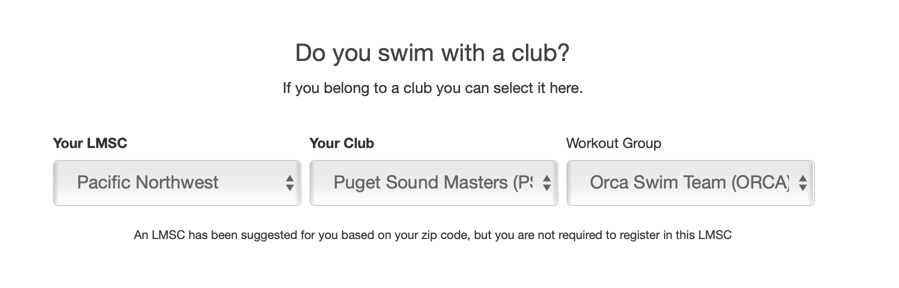

# How to Transfer Your USMS Membership to Orca Swim Team


The best way to ensure you are put on the Orca Swim Team in the USMS registry is to take care of it when you register or updating your renewal.  You can choose `PSM` as the club and then `ORCA`as the workout group. \(see immage below\).

You can also use this link which will pre-fill the fields for you automatically:  [http://usms.orcaswimteam.org](http://usms.orcaswimteam.org)




## Transferring Your USMS Membership to Orca Swim Team

We have created a form that will gather the information needed to make a request to the [local Pacific Northwest LMSC Registrar](https://www.usms.org/lmsc/lmscinfoform.php?LMSCID=36).  Go through the instructions in the form bewlow to submit it in few easy steps:



After you have received a confirmation of the transfer, verify you are now listed on the Orca Swim Team's USMS group in the membership directory link below.



