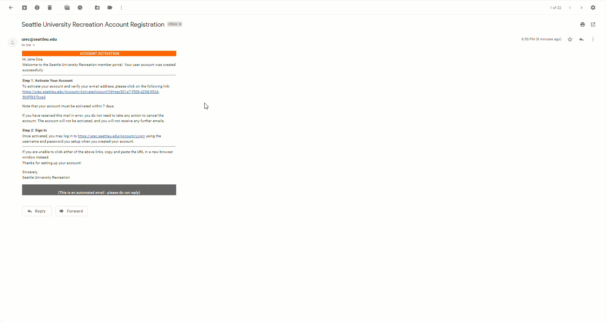
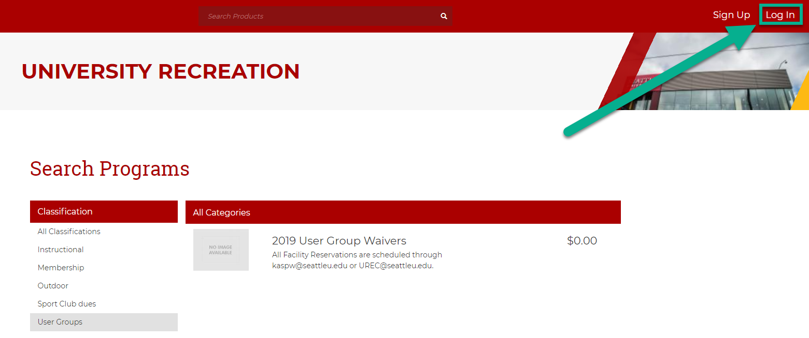
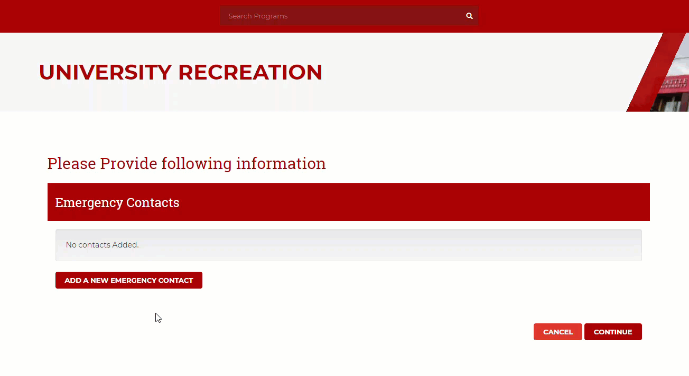
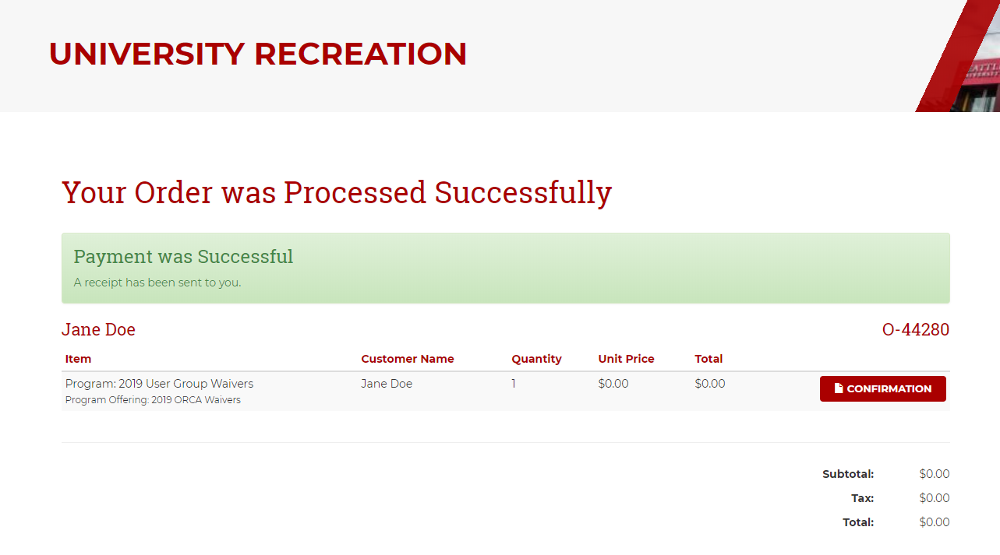

# Complete your Annual SU Waiver

## Creating an Account with Seattle University

Go to the [SeattleU University Recreation Outside User Groups](https://urec.seattleu.edu/Program/GetProducts?productTypeCV=00000000-0000-0000-0000-000000003502&classification=a6eeac98-c66a-441c-bf12-c2901c594c86) Page. If you do not have an account with SeattleU, select "Sign Up" in the top right corner to create an account. Otherwise, go straight to the **Submitting a SU User Group Waiver** below.

Fill in all required fields and select "Register" to create your account. Once you receive the page indicating "Registration Successful", check your email to active your account.

From the Account Seattle University Recreation Account Registration email, select the link under "Step 1: Activate Your Account". Once your account is active and ready to use, you can move on to **Submitting a SU User Group Waiver.**

## Submitting a SU User Group Waiver

Go to the [SeattleU University Recreation Outside User Groups](https://urec.seattleu.edu/Program/GetProducts?productTypeCV=00000000-0000-0000-0000-000000003502&classification=a6eeac98-c66a-441c-bf12-c2901c594c86) Page. ****Select "Sign In" in the top right corner, and login using your SU credentials.

Select the User Group Waivers for the year you are registering. Find the ORCA Waivers and select "Register". A dropdown will prompt you to select the family member you want to register. Select "Register" next yo your name.

Read and sign the User Group Waiver, and select "Accept Now".

Use the "Add a New Emergency Contact" button to fill in required emergency contact information, select "Continue", and select "Checkout" on the shopping cart page that follows. Your shopping cart should show a total of $0.00.

Your waiver is complete when you see the following screen indicating successful payment. You will also receive a confirmation email containing a PDF version of your signed waiver.

SeattleU confirms waiver completion by issuing bag tags to swimmers who have successfully completed a waiver for the calendar year. Your bag tag should be available for pick-up at the group entrance within 1-2 practices after completing the waiver.

